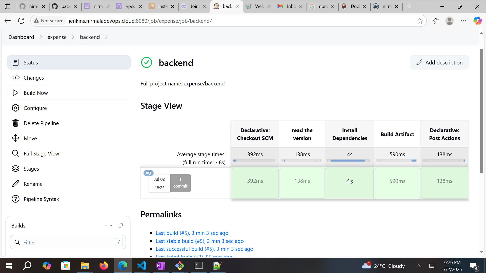

# backendapp-CI

* In this project, Project Infra should be ready by usning Terraform
*          01-vpc/ 02-sg/ 04-db/ 05-openvpn 06-app-alb

* project tools should be ready:
        To create instances for Jenkins-master,jenkins-agent,nexus by using Terraform modules.
        set up the Route 53 records for all the instances

* Application code: backend-CI
             Developer provided the project code with that code, we add Jenkinsfile for CI JOB.
             CI stages: Read Json Version(project version from package.json)
                        Install the dependencies(copy the code)
                        Build the artifact (converted to .zip file or package)
                        Nexus Artifact(push the .zip file to nexus repo)
     ..........................CI Job is completed..........................
     we get the out put: 

     